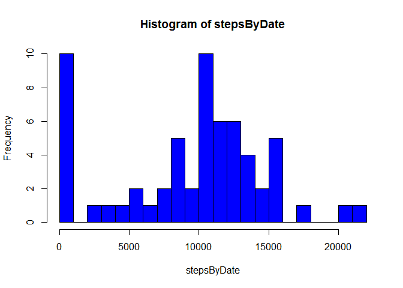
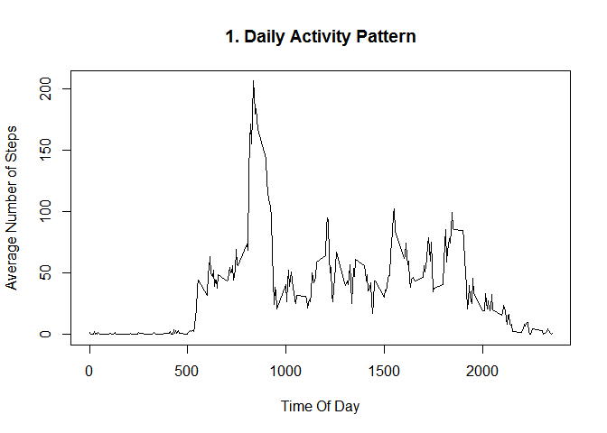
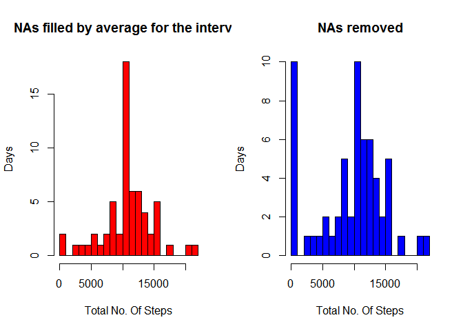
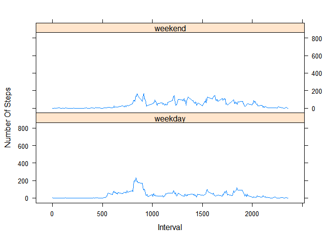

# Reproducible Research: Peer Assessment 1


## Loading and preprocessing the data


```
## Loading required package: gsubfn
## Loading required package: proto
## Loading required package: RSQLite
## Loading required package: DBI
```


```r
temp <- tempfile()
download.file("http://d396qusza40orc.cloudfront.net/repdata%2Fdata%2Factivity.zip", temp)
#download.file("http://github.com/rsamban/RepData_PeerAssessment1/blob/master/activity.zip", temp)
allData <- read.csv(unz(temp,"activity.csv"), sep=",")
unlink(temp)
allData$date <- as.Date(allData$date, "%Y-%m-%d")
```

## What is mean total number of steps taken per day?
**1.Average total Number Of Steps per day**

```r
allCompleteData <- allData[complete.cases(allData),]
stepsByDate <- tapply(allData$steps, allData$date, FUN=sum, na.rm=TRUE)
mean(stepsByDate)
```

```
## [1] 9354.23
```

```r
median(stepsByDate)
```

```
## [1] 10395
```
**1. Histogram of Toal number of Steps per Day**

```r
hist(stepsByDate, breaks=20, col="blue")
```

 

## What is the average daily activity pattern?


```r
avgActivityInMinutesInterval <- aggregate(steps~interval, allData, mean)
plot(avgActivityInMinutesInterval$interval, avgActivityInMinutesInterval$steps, type="l", xlab="Time Of Day", ylab="Average Number of Steps", main="1. Daily Activity Pattern")
```

 

**2. Following 5 minute interval has maximum number of steps on average**

```r
avgActivityInMinutesInterval[avgActivityInMinutesInterval$steps==max(avgActivityInMinutesInterval$steps),]
```

```
##     interval    steps
## 104      835 206.1698
```
## Imputing missing values

**Following are the number of rows that have NAs**

```r
nrow(allData[is.na(allData$steps),])
```

```
## [1] 2304
```

**Following code fills in the NAs with average values for the interval calculated over all dates.**

```r
meanStepsInInterval <- aggregate(steps~interval, allData, mean)
allDataFilled <- sqldf(c("update allData set steps=(select steps from meanStepsInInterval a where a.interval=allData.interval) where steps is null", "select * from allData"))
```

```
## Loading required package: tcltk
```


```r
filledStepsByDate <- tapply(allDataFilled$steps, allDataFilled$date, FUN=sum, na.rm=TRUE)
par(mfcol=c(1,2))
hist(filledStepsByDate, breaks=20, xlab="Total No. Of Steps", ylab="Days", main="NAs filled by average for the interval", col="red")
hist(stepsByDate, breaks=20, xlab="Total No. Of Steps", ylab="Days", main="NAs removed", col="blue")
```

 


**1.Average total Number Of Steps per day after filling NAs with average steps for the interval of all the days**

```r
mean(filledStepsByDate)
```

```
## [1] 10766.19
```

```r
median(filledStepsByDate);
```

```
## [1] 10766.19
```

Mean and median values of number of steps after replacing NAs with average value for that interval is different from when NAs are removed from calculation  

## Are there differences in activity patterns between weekdays and weekends?


```r
weekends <- c("Saturday","Sunday")
allDataFilled$isWeekend <- factor(weekdays(allDataFilled$date) %in% weekends, levels=c(TRUE,FALSE), labels=c("weekend","weekday"))
xyplot(steps~interval | isWeekend, index.cond=list(c(2,1)), data=allDataFilled, layout=c(1,2), xlab="Interval", ylab="Number Of Steps", type="a")
```

 
